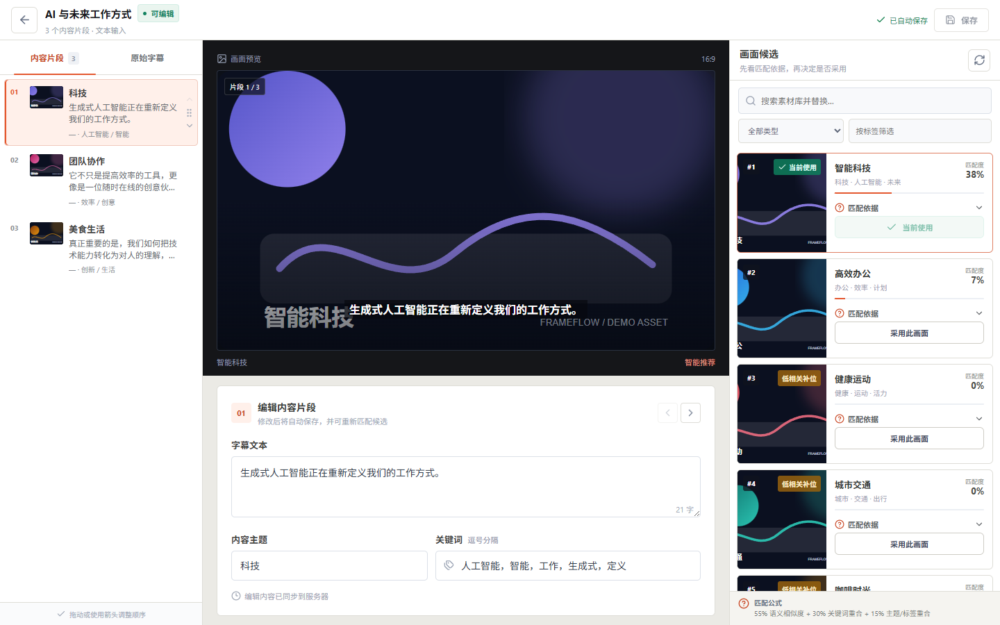
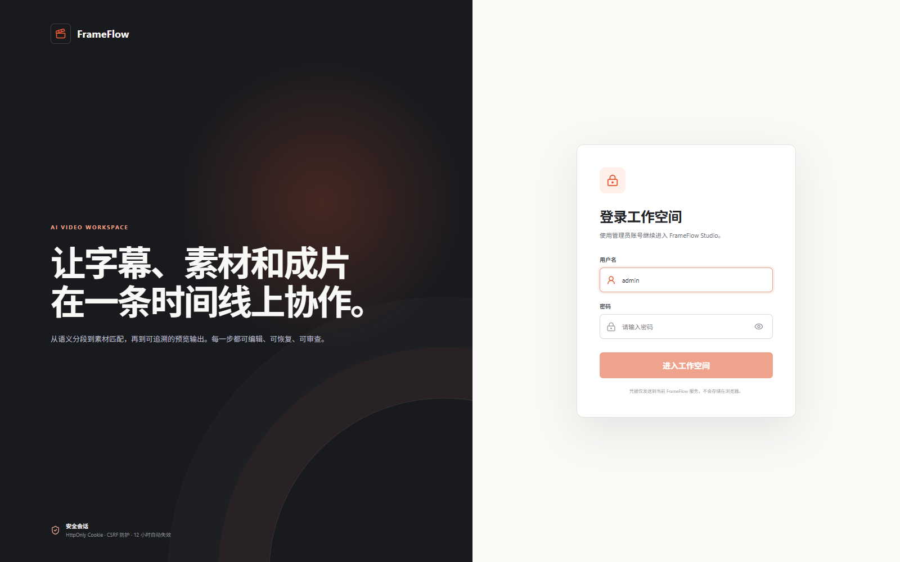
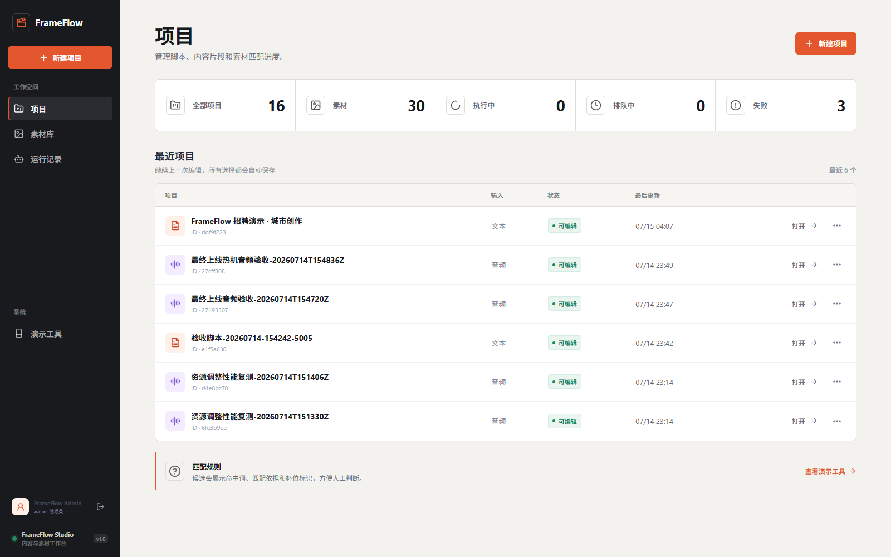
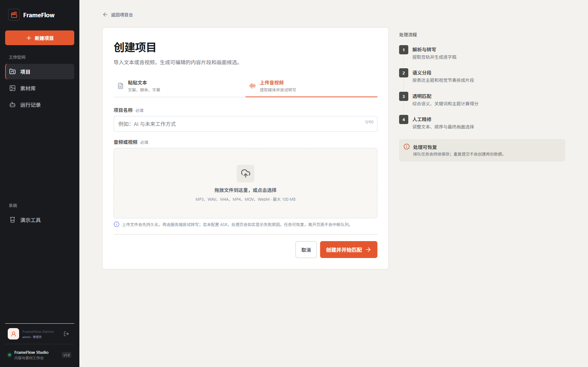
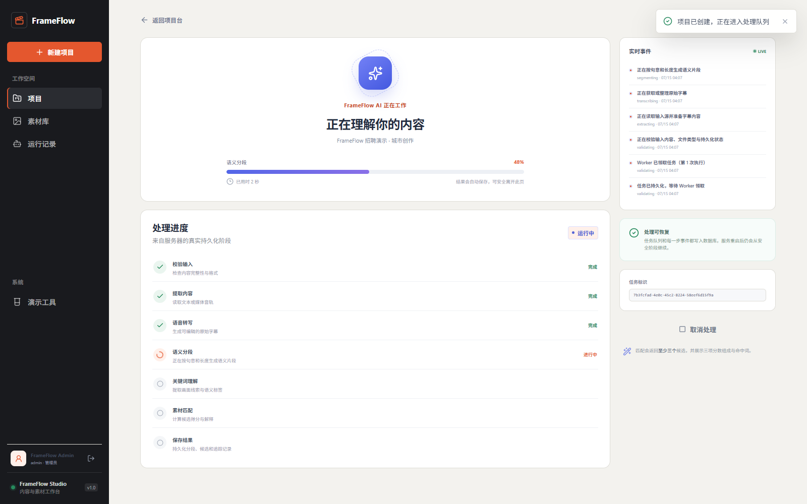
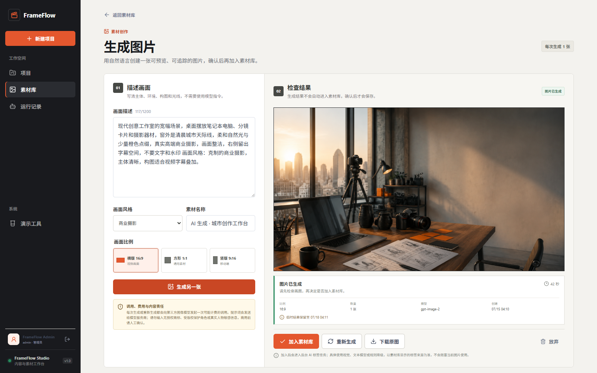
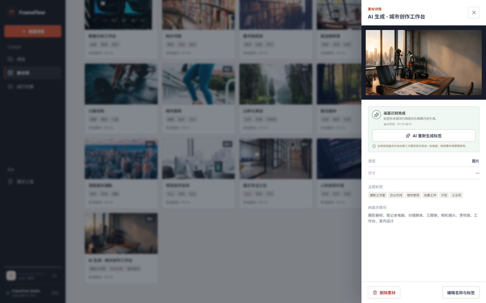
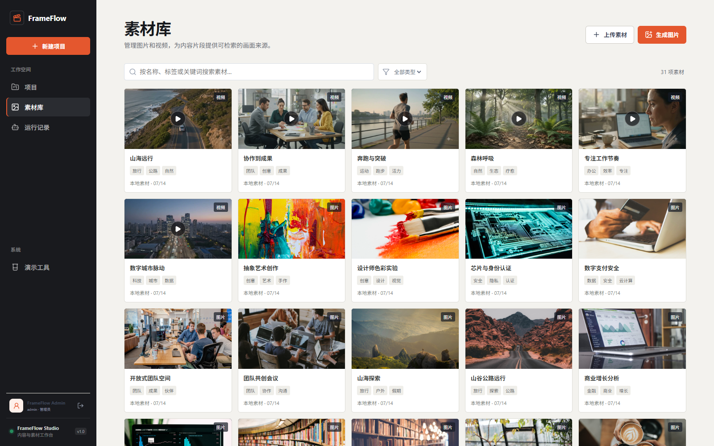
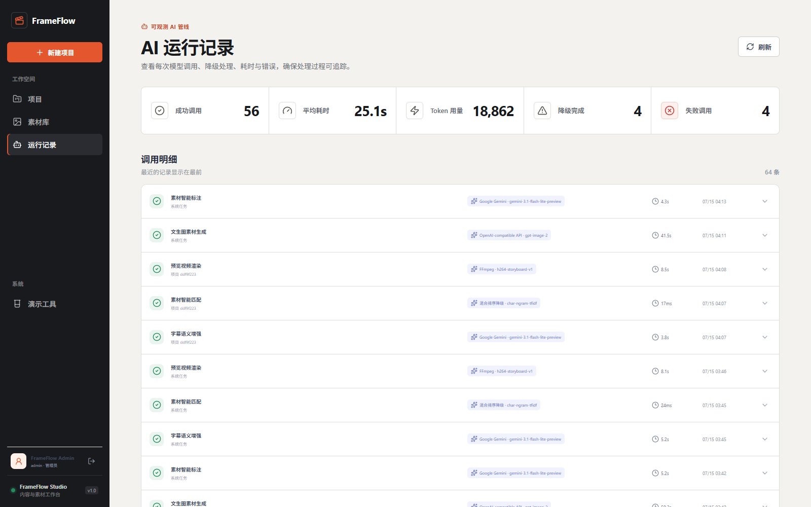
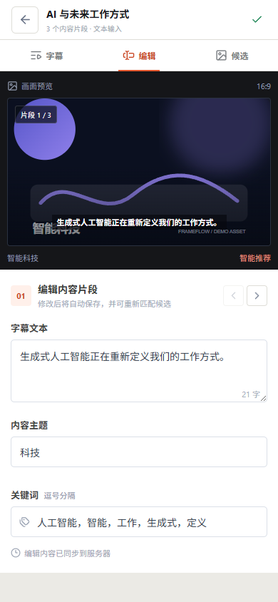

# FrameFlow

[](https://github.com/tiqing2005/frameflow/actions/workflows/ci.yml)
[](https://frameflow.sbh2005.me)
[](LICENSE)

FrameFlow 是一个面向视频内容生产的字幕语义分析与智能素材编排工作台。它把文本、音频或视频转换为可恢复的异步任务，完成字幕整理、语义分段、可解释素材匹配、人工调整、持久化保存和 MP4 组合预览；当素材库没有合适画面时，还可以通过文生图生成新素材，确认入库后继续参与标签、匹配与时间线编排。

## 在线体验

| 项目 | 地址或说明 |
| --- | --- |
| Web 工作台 | [https://frameflow.sbh2005.me](https://frameflow.sbh2005.me) |
| 体验账号 | 用户名 `admin`；临时密码单独提供，不在公开仓库保存管理员凭据 |
| 源码仓库 | [https://github.com/tiqing2005/frameflow](https://github.com/tiqing2005/frameflow) |
| API 文档 | 登录后访问 `https://frameflow.sbh2005.me/api/docs`；静态契约见 [docs/API.md](docs/API.md) |

公开体验环境采用单工作区管理员模式。请勿上传隐私、商业机密或无授权媒体；服务端密钥只从环境变量读取，不进入仓库、浏览器或业务数据库。

## 核心闭环

```text
文本 / 音频 / 视频
        │
        ▼
持久化异步 Job ── ASR / 字幕解析 ── 语义分段 ── 主题与关键词
        │                                      │
        │                                      ▼
        │                         混合排序 + 至少 3 个候选
        │                                      │
        ▼                                      ▼
失败原因 / 取消 / 重试             人工编辑 / 排序 / 搜索替换
                                               │
                                               ▼
                                  Selection 持久化 + 时间线
                                               │
                                               ▼
                                      ffmpeg MP4 预览

素材不足时：自然语言 → Image Worker → 私有草稿 → 用户确认入库
                                      → 单画面标签 → 候选 / 时间线
```

这条链路的设计目标是让自动分析成为可编辑的初稿，而不是不可解释的最终决定。字幕、顺序、素材选择、时长和运行记录都会持久化，页面刷新或服务重启后仍可继续工作。

## 核心能力

| 能力 | 当前实现 |
| --- | --- |
| 多形态输入 | 支持粘贴字幕文本，以及最大 100 MB 的音频/视频上传 |
| 真实语音识别 | 公网环境使用本地 `faster-whisper small/int8`；同时保留 DashScope 与 OpenAI-compatible ASR 适配器 |
| 持久异步任务 | Job、阶段事件、单调进度、并发领取、租约心跳、硬超时、取消、失败原因和人工重试 |
| 字幕整理 | 保留原始字幕，支持语义分段、主题/关键词提取、文本编辑、乐观锁和拖动/箭头排序 |
| 可解释匹配 | 每段至少返回 3 个不同候选，保存语义、关键词、标签/主题分项以及命中词和中文理由 |
| 人工决策 | 可从候选或全素材库快速替换；人工选择不会被后续自动匹配静默覆盖 |
| 素材库 | 内置 24 张图片和 6 段短视频，支持上传、搜索、筛选、元数据编辑与受保护删除 |
| 自动素材标签 | 图片或视频 poster 经过“视觉模型 → 文本 LLM → 本地规则”三级链，界面与运行记录展示实际来源 |
| 文生图素材 | 独立持久任务、单并发 Image Worker、私有草稿、用户确认入库、后台标签和字幕片段应用 |
| 时间线与预览 | 支持目标总时长、单段 1～30 秒精调、自动分配、过期提示和异步 MP4 组合预览 |
| 可观测性 | 记录 provider、model、输入哈希、策略版本、耗时、降级状态、结果摘要与关联任务 |
| 基本安全 | HttpOnly 会话、CSRF 写保护、登录限流、上传签名校验、路径隔离和服务端密钥管理 |

## 产品界面

以下截图于 **2026-07-15** 从当前公网版本采集。

<p align="center">
  
</p>
<p align="center"><sub>三栏工作台：语义片段、画面预览、候选解释、人工替换、时间线和自动保存集中在同一编辑上下文。</sub></p>

<table>
  <tr>
    <td width="50%" valign="top">
      
      <p align="center"><sub>应用登录与安全会话</sub></p>
    </td>
    <td width="50%" valign="top">
      
      <p align="center"><sub>项目、素材和任务状态总览</sub></p>
    </td>
  </tr>
  <tr>
    <td width="50%" valign="top">
      
      <p align="center"><sub>文本、音频和视频输入</sub></p>
    </td>
    <td width="50%" valign="top">
      
      <p align="center"><sub>服务端阶段、实时事件、取消与恢复</sub></p>
    </td>
  </tr>
</table>

<p align="center">
  
</p>
<p align="center"><sub>组合时间线与真实 MP4 播放器：逐段时长可调，输入改变后会明确标记旧预览过期。</sub></p>

<table>
  <tr>
    <td width="50%" valign="top">
      
      <p align="center"><sub>文生图任务：描述画面、选择比例、检查结果并确认入库</sub></p>
    </td>
    <td width="50%" valign="top">
      
      <p align="center"><sub>素材单画面标签、关键词、来源状态与人工修订入口</sub></p>
    </td>
  </tr>
  <tr>
    <td width="50%" valign="top">
      
      <p align="center"><sub>图片/视频素材、搜索筛选、上传和生成入口</sub></p>
    </td>
    <td width="50%" valign="top">
      
      <p align="center"><sub>模型调用、规则策略、预览渲染、耗时和降级轨迹</sub></p>
    </td>
  </tr>
</table>

<details>
<summary>查看移动端工作台</summary>

<p align="center">
  
</p>

</details>

## 架构与匹配策略

```text
React 19 + TypeScript + Vite
              │ 同源 REST / multipart
              ▼
宿主 Nginx（当前公网）/ Caddy（仓库默认部署）
              │
              ▼
FastAPI API ───────── SQLite WAL + /data/media + /data/private
     │                                  ▲
     ├── 持久 Job ─────────────── Core Worker 池
     │    ASR / 分段 / 匹配 / 标签 / ffmpeg
     │
     └── ImageGeneration ──────── 独立单并发 Image Worker
                                          │
                                OpenAI-compatible 图像服务
```

FrameFlow 采用“模块化单体 + 独立持久 Worker”的单机架构。对于当前工作区规模，这比引入 Redis、Kafka 和多套服务更容易运行、备份与恢复，同时仍保留原子领取、租约栅栏、任务追踪以及未来拆分队列、对象存储和向量索引的边界。

素材排序使用透明的混合公式：

```text
final_score = 0.55 × semantic + 0.30 × keyword + 0.15 × tag_topic
```

- 语义通道默认使用字符 n-gram TF-IDF，零外部依赖；配置本地 `BAAI/bge-small-zh-v1.5` 或远程 `/embeddings` 后可切换为神经向量余弦相似度。
- 关键词通道计算字幕关键词与素材关键词的可解释重合度。
- 标签/主题通道计算片段主题与素材标签的重合度。
- 每条 Recommendation 保存三项分数、命中词、中文解释、运行 ID 和策略版本。
- Embedding 或外部模型不可用时回退本地通道，并在运行记录中保留真实 provider、model 和降级状态。

当前公网匹配实际使用字符 n-gram TF-IDF，不把它描述为已启用的神经 Embedding。混合排序的详细设计见 [架构说明](docs/ARCHITECTURE.md) 和 [AI 使用说明](docs/AI_USAGE.md)。

## AI 与数据边界

- **字幕语义增强**：公网环境以 `gemini` Provider 调用 `gemini-3.1-flash-lite-preview`；输出需通过严格 Schema、原文完整性和片段边界校验，否则回退规则分段。
- **语音识别**：公网主路径在服务器本地运行 `faster-whisper small/int8`，原始音视频不会因此发送给外部 ASR；首次加载模型、长音频和并发排队会增加耗时。
- **素材理解**：视觉服务只接收一张规范化图片或视频 poster/单帧，不上传整段视频，也不声称理解镜头关系或动作时序；失败后依次回退文本 LLM 和本地规则。
- **文生图**：使用独立 `IMAGE_API_*` 配置和固定单并发 Worker。结果先进入私有草稿，只有用户确认后才成为正式素材；结果未知时不会自动重复可能计费的调用。
- **密钥隔离**：LLM、ASR、Vision、Embedding 和 Image 分别配置，均由后端启动时读取；审计记录只保存哈希、摘要和模型元数据。
- **工程协作**：需求拆解、方案比较、部分代码初稿、测试扩展、审查和文档整理使用了 Codex 辅助；架构、接口、安全和运行结论以代码、自动测试、运行日志与实际环境复核。

## 运行与部署

### Docker 部署

准备 Linux VPS、Docker Compose、已解析域名以及开放的 80/443 端口：

```bash
git clone https://github.com/tiqing2005/frameflow.git
cd frameflow
bash deploy/first-deploy.sh app.example.com ops@example.com
```

脚本会生成服务器专用 `deploy/.env`、构建多阶段镜像、执行迁移、健康检查和 HTTPS smoke。明文凭据不会写入 Git；DNS、首次部署、升级、备份、恢复和回滚步骤见 [部署手册](docs/DEPLOYMENT.md)。

### 本地开发

需要 Python 3.11+、Node.js 22+ 和 ffmpeg：

```powershell
# 终端 1：API + Core Worker + Image Worker 监督进程
cd backend
python -m venv .venv
.venv\Scripts\Activate.ps1
pip install -r requirements.txt -r requirements-dev.txt
python -m app.serve

# 终端 2：前端开发服务器
cd frontend
npm ci
npm run dev
```

浏览器访问 `http://localhost:5173`。全新数据目录只允许从服务所在机器的回环地址初始化管理员；真实密钥应写入 Git 忽略的 `.env`。未配置外部模型时，文本输入仍可通过本地规则与字符相似度完成核心流程；媒体输入需要可用的本地或外部 ASR。

## 测试与验收

```powershell
# 后端
cd backend
python -m pytest

# 前端
cd ..\frontend
npm run lint
npm run build
npm run test:browser

# API 验收（服务已启动时）
cd ..
.\scripts\acceptance.ps1 -BaseUrl http://127.0.0.1:8000
```

2026-07-15 的本地质量门禁：

| 检查 | 结果 |
| --- | --- |
| 后端 pytest | `222 passed, 1 deselected` |
| 其中文生图专项 | `54 passed` |
| 前端 lint / TypeScript / production build | 通过，1789 modules |
| Chromium Playwright | `48 passed` |
| Windows 启动器契约 | `7 passed` |
| GitHub Actions | 通过 |

同日公网受控样本：文本项目约 5 秒生成 5 个片段且每段不少于 3 个候选；20.1 秒 MP4 预览渲染约 8.5 秒；文生图约 41.5 秒；单画面视觉标签约 4.3 秒。以上仅是单次环境记录，不承诺 SLA；实际调用路径以运行记录中的 provider、model、耗时和 degraded 状态为准。

完整测试范围、故障场景和人工检查清单见 [测试计划](docs/TEST_PLAN.md)。

## 已知边界与演进方向

- 当前公网匹配使用字符 n-gram TF-IDF；神经 Embedding 已有适配器和测试，但需要额外模型或远程服务后才启用。
- 组合预览支持素材拼接与可选字幕烧录，但不恢复原始音轨，也不是帧级非线性剪辑器。
- 视觉标签只理解单张图片或视频 poster/单帧，不覆盖整段视频的多镜头和动作时序。
- SQLite WAL 与本地持久卷适合单机低并发工作区，不支持多个容器共享写入同一数据库文件。
- 当前采用单管理员工作区，没有注册、项目归属、RBAC 或多租户隔离。
- 本地 ASR 冷启动需要下载模型；长音频、噪声和并发任务会增加推理与排队时间。
- 文生图上游通常不提供可验证的费用明细和连续百分比；网络结果未知时，人工确认重试仍可能产生第二次费用。
- 上传已包含大小、类型、签名与路径保护，但尚未接入恶意文件扫描或隔离媒体沙箱。

更完整的影响、缓解方式和路线图见 [已知问题与取舍](docs/KNOWN_ISSUES.md)。

## 文档

- [产品需求](docs/PRD.md)
- [架构说明](docs/ARCHITECTURE.md)
- [项目结构](docs/PROJECT_STRUCTURE.md)
- [数据模型](docs/DATA_MODEL.md)
- [API 契约](docs/API.md)
- [UI 规范](docs/UI_SPEC.md)
- [部署手册](docs/DEPLOYMENT.md)
- [测试计划](docs/TEST_PLAN.md)
- [AI 使用说明](docs/AI_USAGE.md)
- [文生图设计](docs/IMAGE_GENERATION.md)
- [需求追踪与验收矩阵（附录）](docs/SCORING_MATRIX.md)

## License

[MIT](LICENSE)
