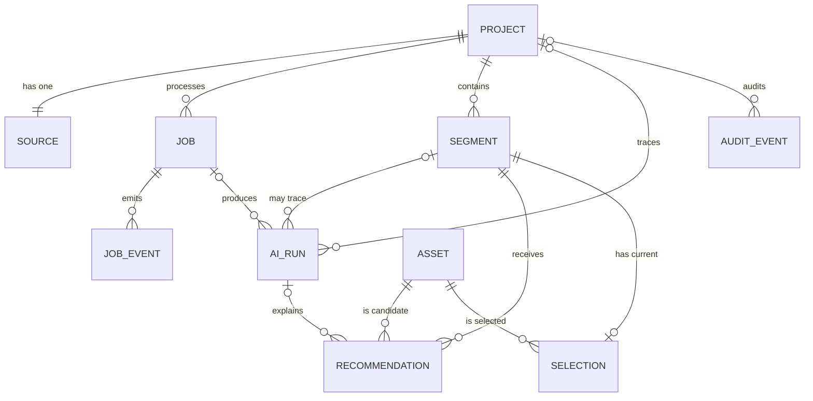

# FrameFlow AI 数据模型

## 1. 范围与原则

本文描述 Demo 1.0 的实际 SQLite/SQLAlchemy 持久化模型。它服务于三个核心不变量：

1. 项目、任务、片段、推荐和人工选择在刷新/进程重启后仍存在。
2. 每个片段只有一个当前选择，每个候选在同一片段内唯一。
3. 异步处理的真实状态位于数据库，而非 API/Worker 内存。

所有主键除 singleton 控制表外均是字符串 ID，客户端必须把其当作不透明值。时间以 UTC 写入。

## 2. 关系概览



运行控制实体 `IDEMPOTENCY_RECORD`、`FAULT_CONTROL` 和 `WORKER_HEARTBEAT` 不参与业务对象展示，但是幂等、故障演练和 readiness 的证据。

## 3. 业务实体

### 3.1 `projects`

| 列 | 类型 | 约束/语义 |
| --- | --- | --- |
| `id` | String(36) | PK，服务端生成 |
| `title` | String(160) | 非空，已去除首尾空白 |
| `status` | String(24) | 非空，索引；`queued/processing/ready/failed/canceled` |
| `input_kind` | String(24) | 非空；`text/audio/video` |
| `created_at` | DateTime(TZ) | 非空 |
| `updated_at` | DateTime(TZ) | 非空，更新时刷新 |

项目是聚合根。删除 Project 级联删除 Source、Job/JobEvent、Segment/Recommendation/Selection 与项目审计事件；Asset 是全局素材，不随项目删除。

### 3.2 `sources`

| 列 | 类型 | 约束/语义 |
| --- | --- | --- |
| `id` | String(36) | PK |
| `project_id` | FK | 非空、唯一、索引；Project CASCADE |
| `kind` | String(24) | `text/audio/video` |
| `original_filename` | String(255) | 仅元数据，不作存储路径 |
| `storage_path` | Text | 服务端私有路径，不向 API 客户端暴露 |
| `public_url` | Text | 允许客户端使用的媒体 URL |
| `mime_type` | String(160) | 媒体类型 |
| `size_bytes` | Integer | 默认 0，非空 |
| `sha256` | String(64) | 非空；用于追溯/内容摘要 |
| `content` | Text | 文本输入原文；媒体时可空 |
| `transcript_text` | Text | ASR 真实转写结果；未转写时为空 |
| `created_at` | DateTime(TZ) | 非空 |

Project 与 Source 是 1:1。本版不将“同一项目替换输入”纳入范围；如需输入版本，未来应取消唯一约束并增加 `is_current/version`。

### 3.3 `segments`

| 列 | 类型 | 约束/语义 |
| --- | --- | --- |
| `id` | String(36) | PK |
| `project_id` | FK | 非空、索引；Project CASCADE |
| `position` | Integer | 项目内从 0 开始的顺序 |
| `text` | Text | 非空字幕片段 |
| `topic` | String(80) | 非空主题 |
| `keywords_json` | Text | JSON 字符串，默认 `[]` |
| `start_ms` / `end_ms` | Integer | 可空；仅当真实 ASR 有时间戳时写入 |
| `version` | Integer | 乐观锁，初始 1，每次编辑递增 |
| `created_at` / `updated_at` | DateTime(TZ) | 非空 |

唯一约束 `UNIQUE(project_id, position)`。重排时不应逐行从旧位置直接改为新位置，否则可触发中间态唯一冲突。实现应在同一事务中先移到临时偏移位置，再写入 0..N-1，并验证 ID 集完全相同。

### 3.4 `assets`

| 列 | 类型 | 约束/语义 |
| --- | --- | --- |
| `id` | String(64) | PK；允许稳定 seed ID |
| `name` | String(160) | 非空、索引 |
| `kind` | String(24) | 非空、索引；`image/video` |
| `public_url` | Text | 非空；页面预览使用 |
| `storage_path` | Text | 私有磁盘路径，可空 |
| `mime_type` | String(160) | 可空 |
| `size_bytes` | Integer | 默认 0，非空 |
| `tags_json` | Text | JSON 字符串，默认 `[]` |
| `keywords_json` | Text | JSON 字符串，默认 `[]` |
| `is_seed` | Boolean | 是否为项目预置、授权安全素材 |
| `active` | Boolean | 默认 true，索引；排序与普通搜索仅用 active |
| `created_at` / `updated_at` | DateTime(TZ) | 非空 |

对素材使用软删除/禁用，便于保留已有推荐追溯。被 Selection 引用的 Asset 有 `RESTRICT` 保护，不得直接物理删除。

## 4. 任务与恢复实体

### 4.1 `jobs`

| 列 | 类型 | 约束/语义 |
| --- | --- | --- |
| `id` | String(36) | PK |
| `project_id` | FK | 非空、索引；Project CASCADE |
| `status` | String(24) | 非空、索引；`queued/running/succeeded/failed/canceled` |
| `stage` | String(32) | 非空；默认 `validating` |
| `progress` | Integer | 0～100，单调递增 |
| `attempt` | Integer | 当前尝试次数，默认 0 |
| `max_attempts` | Integer | 默认 3 |
| `next_run_at` | DateTime(TZ) | Worker 最早可领取时间 |
| `lease_owner` | String(120) | 当前 Worker ID，可空 |
| `lease_expires_at` | DateTime(TZ) | 租约过期时间，可空 |
| `heartbeat_at` | DateTime(TZ) | 当前任务最后心跳，可空 |
| `error_code` / `error_message` | String/Text | 失败终态的机器/人类可读原因 |
| `retryable` | Boolean | 默认 false；人工重试的服务端判断 |
| `created_at` / `started_at` / `finished_at` / `updated_at` | DateTime(TZ) | 生命周期时间 |

复合索引 `ix_jobs_claim(status, next_run_at, lease_expires_at)` 服务于 Worker 领取和过期恢复。

状态不变量：

- 只有 queued 可被领取为 running。
- succeeded/failed/canceled 是终态；“重试”是从 failed 显式恢复 queued，不修改原历史事件。
- running 任务只有租约所有者可续租/写入阶段。
- 过期租约可恢复为 queued 或在达到 `max_attempts` 后 failed，并追加事件。
- 业务流水线必须幂等，因为 Worker 可在不确定的崩溃点后重执行。

### 4.2 `job_events`

| 列 | 类型 | 语义 |
| --- | --- | --- |
| `id` | String(36) | PK |
| `job_id` | FK | 非空、索引；Job CASCADE |
| `stage` | String(32) | 写入时所处阶段 |
| `progress` | Integer | 当时持久化进度 |
| `message` | Text | 面向用户/调试的简短消息 |
| `level` | String(16) | `info/warning/error` |
| `created_at` | DateTime(TZ) | 非空 |

JobEvent 是只追加时间线，不使用 UPDATE 重写历史。当前状态以 Job 为准，事件用于解释过程。

### 4.3 `worker_heartbeats`

| 列 | 类型 | 语义 |
| --- | --- | --- |
| `id` | Integer | singleton PK，当前默认 1 |
| `worker_id` | String(120) | 当前 Worker 标识 |
| `heartbeat_at` | DateTime(TZ) | 最近心跳 |

Readiness 可根据心跳时间与配置阈值判断 Worker 是否就绪。它不是多 Worker 注册表；当前产品边界是单 Worker。

## 5. 匹配、选择与追溯

### 5.1 `ai_runs`

表名为历史产品概念，它记录“智能/匹配运行”，不意味着每行都是外部 AI API 调用。默认规则流水线应如实写 `provider=rules`。

| 列 | 类型 | 语义 |
| --- | --- | --- |
| `id` | String(36) | PK |
| `project_id` | FK nullable | Project 删除时 SET NULL |
| `job_id` | FK nullable | Job 删除时 SET NULL |
| `segment_id` | FK nullable | 局部重匹配时可指向 Segment；删除 SET NULL |
| `operation` | String(64) | 例如 `segment_and_match` / `rematch_segment` |
| `provider` | String(80) | 默认真实值 `rules` |
| `model` | String(120) | 例如 `hybrid-tfidf-v1`；规则/策略名也放此字段 |
| `prompt_version` | String(40) | 对规则流水线表示输入/策略版本 |
| `input_hash` | String(64) | 非空；追溯而不无限复制原文 |
| `status` | String(24) | `succeeded/failed` 等 |
| `degraded` | Boolean | 是否在本运行使用降级路径 |
| `duration_ms` | Integer | 运行耗时 |
| `output_summary_json` | Text | JSON 结果摘要，默认 `{}` |
| `error_message` | Text | 可空；不包含 Key/请求 Header |
| `created_at` | DateTime(TZ) | 非空 |

Demo 1.0 不单独建 `match_runs`表；一次混合匹配的策略版本和结果摘要统一存在 AIRun，具体候选存在 Recommendation。

### 5.2 `recommendations`

| 列 | 类型 | 语义 |
| --- | --- | --- |
| `id` | String(36) | PK |
| `run_id` | FK nullable | AIRun SET NULL；运行删除不破坏当前候选 |
| `segment_id` | FK | 非空、索引；Segment CASCADE |
| `asset_id` | FK | 非空、索引；Asset CASCADE（实际素材优先软禁用） |
| `rank` | Integer | 1 开始的展示排名 |
| `total_score` | Float | 混合分，0～1 |
| `tfidf_score` | Float | 字符 n-gram TF-IDF 余弦相似度 |
| `keyword_score` | Float | 归一化关键词重合 |
| `tag_score` | Float | 标签/主题重合 |
| `matched_terms_json` | Text | JSON 命中词数组 |
| `explanation` | Text | 非空中文解释 |
| `is_diversity_filler` | Boolean | 低相关候选补齐标识 |
| `created_at` | DateTime(TZ) | 非空 |

唯一约束：

- `UNIQUE(segment_id, asset_id)`：同一片段不重复推荐素材。
- `UNIQUE(segment_id, rank)`：同一片段不出现重复排名。

重新匹配应在一个事务中删除/替换当前片段候选并插入新集合。不应先提交空候选，再逐个增加。

### 5.3 `selections`

| 列 | 类型 | 语义 |
| --- | --- | --- |
| `id` | String(36) | PK |
| `segment_id` | FK | 非空、唯一、索引；Segment CASCADE |
| `asset_id` | FK | 非空、索引；Asset RESTRICT |
| `source` | String(16) | `auto/manual` |
| `created_at` / `updated_at` | DateTime(TZ) | 非空 |

`UNIQUE(segment_id)` 强制每个片段一个当前选择。用户替换是 upsert，保存 `source=manual`。重新匹配只更新 Recommendation，不删除已有 manual Selection。

### 5.4 `audit_events`

| 列 | 类型 | 语义 |
| --- | --- | --- |
| `id` | String(36) | PK |
| `project_id` | FK nullable | Project CASCADE；全局素材事件可空 |
| `entity_type` | String(48) | `project/job/segment/selection/asset/fault` 等 |
| `entity_id` | String(64) | 目标资源 ID，可空 |
| `action` | String(80) | 索引；稳定动作名，例 `selection.updated` |
| `before_json` / `after_json` | Text | JSON 摘要，可空；不写密钥或无限原文 |
| `actor` | String(48) | 默认 `user`；Worker 可使用 `system/worker` |
| `request_id` | String(80) | 关联 HTTP 日志，可空 |
| `created_at` | DateTime(TZ) | 非空 |

AuditEvent 与 JobEvent 职责不同：JobEvent 解释某个耗时任务怎样执行；AuditEvent 解释资源被谁/什么路径修改。

## 6. 控制实体

### 6.1 `idempotency_records`

| 列 | 类型 | 语义 |
| --- | --- | --- |
| `id` | String(36) | PK |
| `scope` | String(80) | 例 `projects:text` / `projects:upload` |
| `key` | String(200) | 客户端幂等键 |
| `request_hash` | String(64) | 规范化请求摘要 |
| `resource_id` | String(36) | 已创建 Project ID |
| `job_id` | String(36) | 已创建 Job ID |
| `created_at` | DateTime(TZ) | 非空 |

`UNIQUE(scope, key)`。创建 Project、Source、Job 和 IdempotencyRecord 必须在一个数据库事务中。命中同 Key 时：

- `request_hash` 相同：返回原 `resource_id/job_id`。
- `request_hash` 不同：409 `IDEMPOTENCY_CONFLICT`，不重用原结果。

### 6.2 `fault_controls`

| 列 | 类型 | 语义 |
| --- | --- | --- |
| `id` | Integer | singleton PK，默认 1 |
| `next_mode` | String(32) | `none/ai_degrade/job_fail` |
| `updated_at` | DateTime(TZ) | 最近设置时间 |

Worker 在领取相关任务时应以事务方式读取并恢复 `none`，确保故障只被一个任务消费。该表是 Demo 验收工具，不是生产 Feature Flag 系统。

## 7. JSON 字段规则

为保持 SQLite 便携性，标签、关键词、命中词和摘要使用 Text 存储规范 JSON。边界规则：

- ORM 层不把 JSON 字符串直接返回前端；响应必须是数组/对象。
- 写入前去除空白、空项和重复项，并限制数量/单项长度。
- JSON 解析失败时按数据完整性错误处理并留下 request/job ID，不静默返回伪造默认值。
- 未来迁移 PostgreSQL 时可转为 JSONB，但不改变 API 契约。

## 8. 关键事务边界

### 8.1 创建项目

```text
BEGIN
  validate/claim idempotency key
  INSERT project
  INSERT source
  INSERT job(status=queued)
  INSERT initial job_event
  INSERT idempotency_record
  INSERT audit_event
COMMIT
```

任一步失败时不得留下无 Job 的 Project 或无 Project 的 IdempotencyRecord。

### 8.2 Worker 完成处理

耗时计算可在事务外完成；最终落库需在短事务中：

```text
BEGIN
  replace/create segments idempotently
  replace recommendations for affected segments
  upsert automatic selections only when no manual selection exists
  insert ai_run + audit summary
  set project=ready
  set job=succeeded, stage=completed, progress=100
  append final job_event
COMMIT
```

不应在事务中等待 ASR/LLM/ffmpeg 等外部耗时操作。

### 8.3 人工选择

```text
BEGIN
  validate segment and active asset
  read before selection
  upsert selection(source=manual)
  insert audit_event(before, after)
COMMIT
```

相同选择重放应返回当前结果，不创建第二行。

## 9. SQLite 运行设置

连接建立后设置：

```sql
PRAGMA journal_mode=WAL;
PRAGMA foreign_keys=ON;
PRAGMA busy_timeout=10000;
PRAGMA synchronous=NORMAL;
```

同时使用 SQLAlchemy `pool_pre_ping=True`。这些设置只是为单机 API + 单 Worker 提高可靠性，不使 SQLite 变成跨机分布式数据库。

## 10. 初始化、迁移与备份

- Demo 1.0 启动时由 SQLAlchemy metadata 创建缺失的表，再幂等 seed 本地素材。
- 本方式适合一次性 Demo 初始化，但不支持可审核的破坏性 schema 升级。正式长期运行前应引入 Alembic 版本迁移。
- 备份必须同时覆盖 `frameflow.db` 和 `media/`；仅复制 DB 会留下失效媒体引用。
- 在 WAL 模式下应使用 SQLite online backup API 或在受控停写窗口备份，不应只拷贝主 DB 文件而忽略 WAL。
- 数据保留与上传配额尚未作为多租户产品实现，见 `KNOWN_ISSUES.md`。

## 11. 生产迁移路线

| Demo 1.0 | 生产方向 | 不变契约 |
| --- | --- | --- |
| SQLite | PostgreSQL | Project/Job/Segment 状态和 ID 语义 |
| DB 持久队列 | PostgreSQL outbox + Redis/RabbitMQ | 创建事务原子性、幂等键 |
| 本地文件 | S3/R2/OSS | Source/Asset 的公开 URL 契约 |
| Text JSON | JSONB/关系标签表 | API 数组格式 |
| 内存 TF-IDF | 向量索引 + 关键词候选融合 | Recommendation 分项证据与解释 |

迁移不能破坏人工 Selection 优先、推荐可追溯和任务幂等三个核心不变量。
